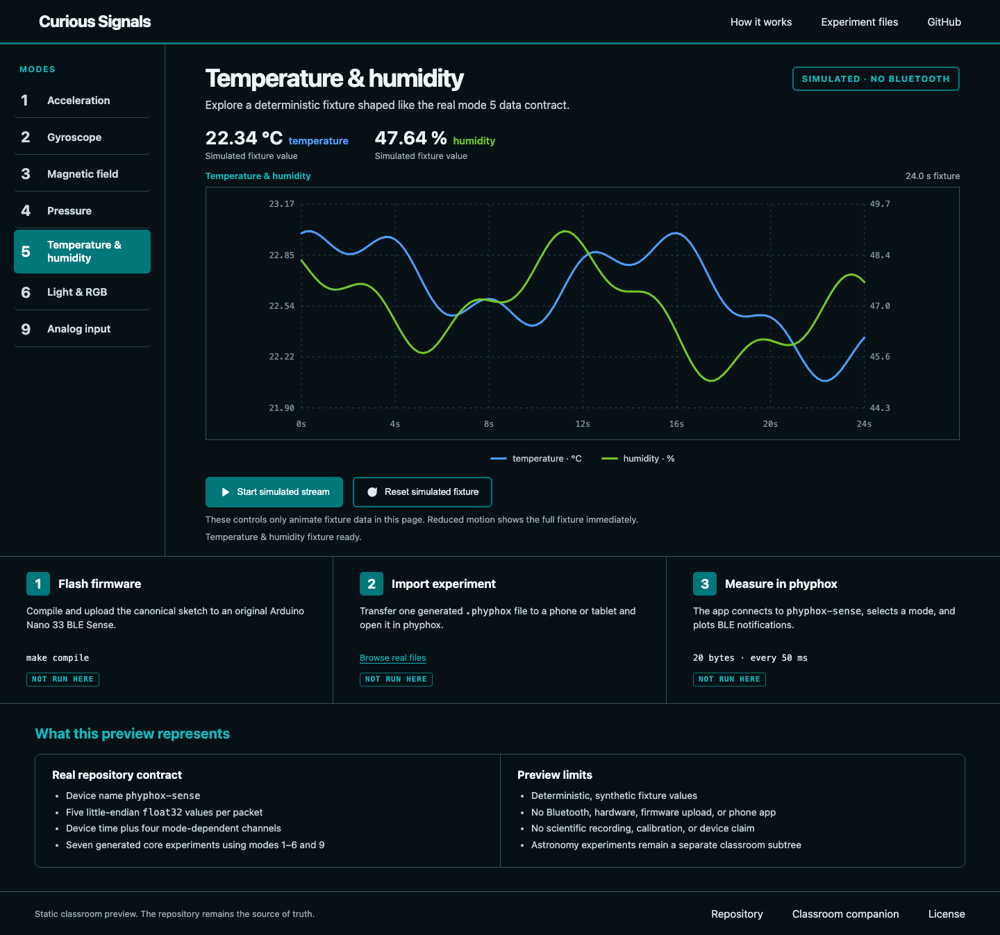
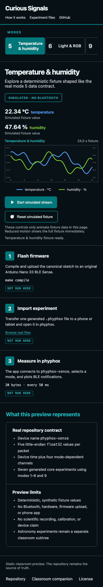
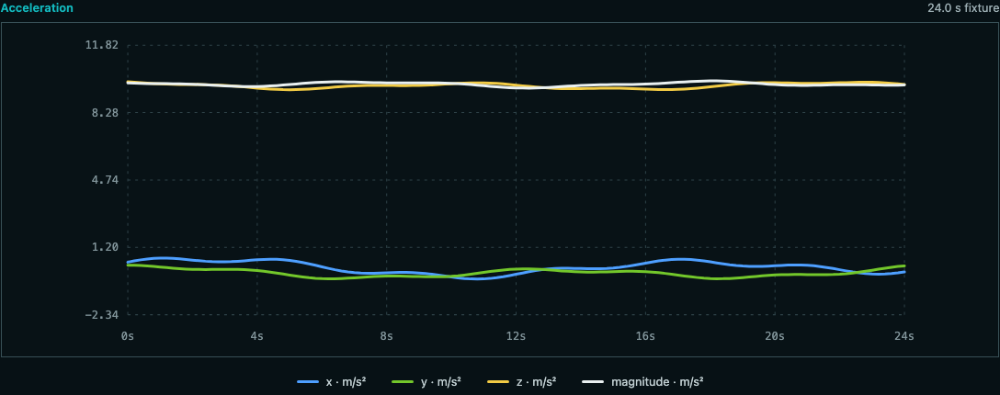
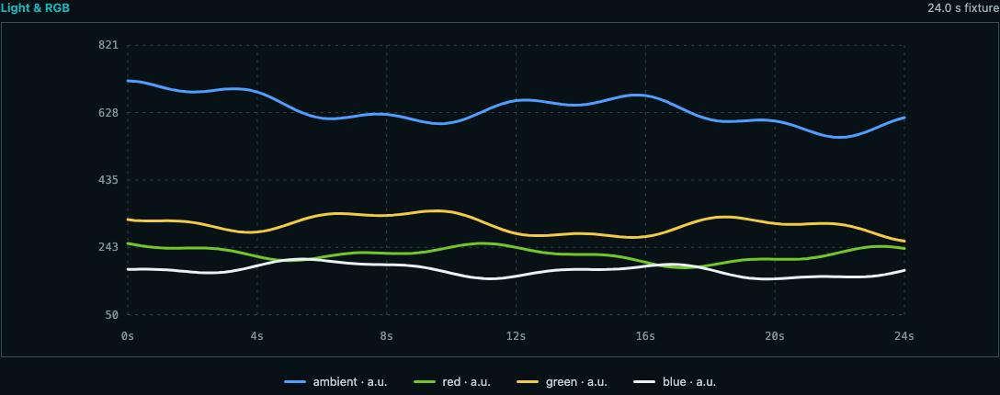
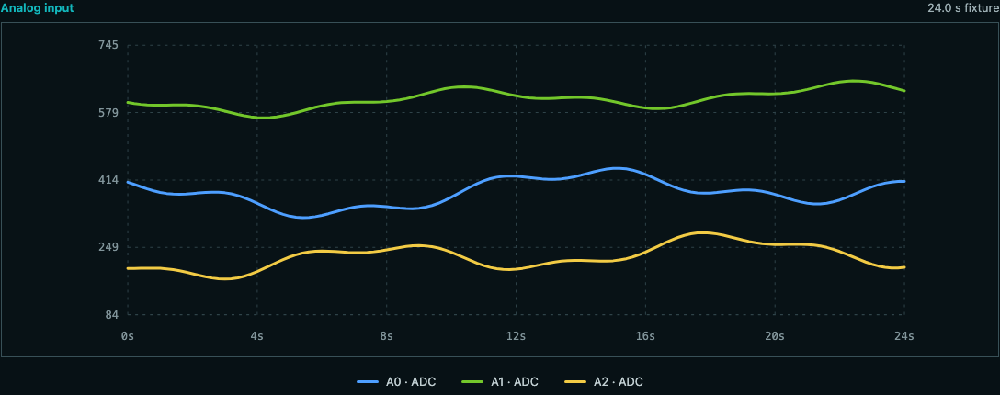

# Curious Signals

[](https://github.com/sebastianspicker/curious-signals-phyphox/actions/workflows/ci.yml)
[](https://github.com/sebastianspicker/curious-signals-phyphox/actions/workflows/pages.yml)

Plug an original Arduino Nano 33 BLE Sense into a laptop, flash one sketch, and
read its sensors live in the [phyphox](https://phyphox.org) app on a phone. No
server, no account, and no mobile app to build.

This repository packages that workflow as a classroom kit: the firmware, seven
ready-to-import experiments, a separate astronomy collection that uses phone and
lab sensors on its own, and a static browser preview you can open without any
hardware.

**Live preview:** <https://sebastianspicker.github.io/curious-signals-phyphox/>

## What is in the box

| Part | What it gives you |
| --- | --- |
| **Arduino + phyphox kit** | Firmware for the original Nano 33 BLE Sense, plus seven importable experiments (`experiments/*.phyphox`) |
| **Astronomy collection** | Eight self-contained experiments for phone sensors, TI SensorTags, a Bluetooth HID mouse, or Owon multimeters (`experiments/astronomy/`) |
| **Static preview** | A deterministic, offline demo of the kit's data shapes (`demo/`) |

## Screenshot tour

The preview renders fixed fixtures, so what you see here is reproducible and not
recorded hardware data. Pick a mode on the left, hit **Start simulated stream**,
and the traces and readouts fill in.



It reflows to a phone-sized viewport, so students can compare it with the real
phyphox layout:



Each mode has its own chart, units, and readouts:

| Acceleration (mode 1) | Light and RGB (mode 6) | Analog input (mode 9) |
| --- | --- | --- |
|  |  |  |

## Flash the firmware

1. Open `arduino/phyphox_ble_sense/phyphox_ble_sense.ino` in the Arduino IDE.
2. Select the **original** Arduino Nano 33 BLE Sense and upload the sketch.
3. Copy one `experiments/*.phyphox` file to a phone or tablet.
4. Open it in phyphox and start the experiment.

Prefer the command line?

```sh
make provision   # install the pinned board core and libraries (uses the network)
make compile     # verify the installed pins and compile
arduino-cli upload -p /dev/ttyACM0 \
  --fqbn arduino:mbed_nano:nano33ble arduino/phyphox_ble_sense
```

`make provision` is the only step that downloads packages. `make compile` checks
the installed versions and builds; it never installs anything or touches a
connected board.

The firmware targets the original Nano 33 BLE Sense (LSM9DS1, HTS221, LPS22HB,
APDS9960). The Rev2 board is not supported.

## The seven core experiments

The firmware advertises as `phyphox-sense`. Each experiment selects one sensor
mode and receives five little-endian `float32` values per BLE notification:
device time, then four mode-dependent channels.

| Mode | Experiment file | Measurement |
| --- | --- | --- |
| 1 | `accelerometer_plot_v1-2.phyphox` | x, y, z, magnitude |
| 2 | `gyroscope_plot_v1-2.phyphox` | x, y, z, magnitude |
| 3 | `magnetometer_plot_v1-2.phyphox` | x, y, z, magnitude |
| 4 | `pressure_plot_v1-2.phyphox` | pressure |
| 5 | `temperature_plot_v1-2.phyphox` | temperature, humidity |
| 6 | `light_plot_v1-2.phyphox` | clear, red, green, blue |
| 9 | `analog_input_plot_v1-2.phyphox` | A0, A1, A2 |

Modes 7 and 8 are reserved. Channels a mode cannot produce are sent as `NaN`.

The importable files in `experiments/` are generated. Edit the sources in
`src/phyphox/` and rebuild, rather than changing the root files by hand.

## The astronomy collection

`experiments/astronomy/` is a separate, hand-maintained set of eight activities
covering reflected light, comparative warming, thermal response to distance,
pressure, pressure and temperature trends, tidal locking, and transit light
curves. They run on phone sensors, TI SensorTags, a Bluetooth HID mouse, or
supported Owon multimeters, and they never touch the Arduino firmware.

`owon_digital_multimeter-debug.phyphox` is an integration helper rather than a
standalone lesson, so its name is not a sign that it can be deleted.

Every astronomy file keeps English as the root locale and ships German and
French translations. The [astronomy companion](docs/ASTRONOMY_EXPERIMENTS_COMPANION.md)
explains what each activity measures and where its interpretation stops.

## Build and verify

The internals are a Python package you never have to import. `make` is the
interface:

```sh
make lint             # Ruff lint and format checks, ShellCheck
make test             # behavior-focused pytest suite
make test-browser     # Chromium preview interaction and accessibility checks
make validate         # protocol, XML, core, and astronomy validation
make check-generated  # non-mutating byte parity check
make build            # rewrite the seven tracked generated files
make provision        # install pinned Arduino packages (network)
make compile          # check installed pins and compile, no installs or upload
make security         # credential-pattern scan
make ci               # full checkout-non-mutating local gate
make bundle           # deterministic core experiment ZIP
```

Requirements: Make, Bash, Git, Python 3.11+, a C++17 compiler (`c++`, or set
`CXX`) for the host firmware tests, Node.js 22+ for the preview fixtures,
`xmllint`, ShellCheck for `make lint`, `arduino-cli` for firmware compilation,
and `ripgrep` for the security scan.

```sh
python3 -m venv .venv
source .venv/bin/activate
python -m pip install -e '.[test,browser]'
python -m playwright install chromium
```

To regenerate the screenshots in this README:

```sh
PREVIEW_SCREENSHOT_DIR=docs/images make test-browser
```

To build into a temporary directory without touching tracked artifacts:

```sh
PYTHONPATH=src python3 -m curious_signals build --output /tmp/phyphox-output
```

## The BLE contract

- Device and local name: `phyphox-sense`.
- Data characteristic: notify-only, 20 bytes, five little-endian `float32`
  values.
- Config characteristic: readable/writable, one little-endian `float32` mode.
- Minimum notification interval: 50 ms.
- Unavailable sensor channels are sent as `NaN`.

`protocol/contract.json` is the normative record of the device name, UUIDs,
frame encoding, mode numbers, channel meanings, and filenames. The firmware, the
experiment XML, and the preview are concrete implementations, and validation
keeps them in step with that record.

Know the limits before you build a lesson around it:

- Every board uses the same name and UUIDs, so you cannot tell two boards apart.
- If BLE initialization fails the sketch stops. There is no status
  characteristic, serial diagnostic, or error LED to tell you why.
- The checks in this repository are software checks. They cannot confirm real
  sensor readings, radio behavior, analog wiring, calibration, whether phyphox
  imports and renders a file, content rights, or classroom safety.

## Repository layout

| Path | Responsibility |
| --- | --- |
| `protocol/contract.json` | Normative cross-component protocol and mode data |
| `arduino/phyphox_ble_sense/` | Firmware and hardware notes |
| `arduino/toolchain.json` | Pinned board core, sensor libraries, and FQBN |
| `src/phyphox/` | Editable core experiment sources |
| `experiments/*.phyphox` | Generated importable core artifacts |
| `experiments/astronomy/` | Hand-edited astronomy collection |
| `demo/` | Deterministic static preview |
| `src/curious_signals/` | Internal build and validation package |
| `tests/` | Observable behavior and contract checks |
| `scripts/` | Shell credential scan behind `make security` |

Start with [docs/ARCHITECTURE.md](docs/ARCHITECTURE.md) for the dependency rules
and the reasoning behind them, [CONTRIBUTING.md](CONTRIBUTING.md) for the
day-to-day workflows, and [docs/ci.md](docs/ci.md) for what runs in CI.

## License

See [LICENSE](LICENSE). Component provenance and distribution rights have not
been fully reconciled yet, so a root license file is not a claim that the
repository is release-ready. Core phyphox attribution notes live in
[src/phyphox/README.md](src/phyphox/README.md).
