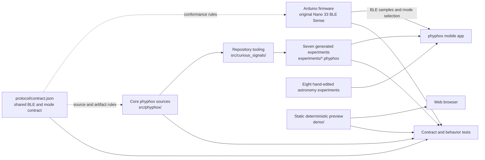
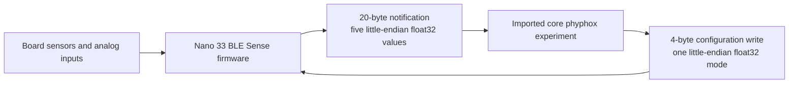
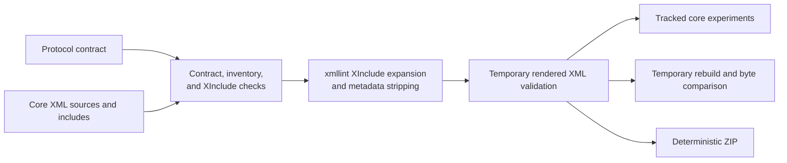

# Architecture

<!-- markdownlint-disable MD013 -->

Curious Signals is a repository of teaching artifacts, not a deployed service or
a single application. It maintains an Arduino and phyphox classroom kit, a
separate astronomy experiment collection, and a static browser preview. The
Python package in `src/curious_signals/` exists only to build and verify those
deliverables; nothing at runtime depends on it.

## System overview



The dashed edges are conformance expectations, not imports. The firmware, the
experiment files, and the preview never load the JSON contract at runtime; each
duplicates the few values it needs, and checks derived from the contract stop
those copies from drifting apart:

- **Firmware:** the sketch stays one self-contained `.ino` that teachers can
  copy into the Arduino IDE. `tests/firmware/` compiles that exact file on the
  host against BLE, sensor, and clock doubles, runs its own `setup()` and
  `loop()`, and asserts the advertised name, UUIDs, characteristic properties
  and sizes, default mode, mode selection, and packet layout against
  expectations rendered from `protocol/contract.json`. Mutation cases prove the
  test catches each kind of drift.
- **Core experiments:** `make validate` checks sources and generated files
  against the parsed contract (UUIDs, offsets, conversions, mode per filename).
- **Preview:** `tests/preview/` evaluates `demo/fixtures.js` and compares its
  modes and channel shapes with the contract.

## Components and ownership

| Path | Responsibility | Runtime or distribution boundary |
| --- | --- | --- |
| `protocol/contract.json` | Device identity, UUIDs, frame encoding, timing, modes, channel meanings, and core filenames | Normative repository contract; not deployed |
| `arduino/phyphox_ble_sense/` | Sensor acquisition, mode selection, BLE service, and notifications | Independently compiled and flashed firmware |
| `src/phyphox/` | Seven editable core experiment definitions and local XInclude fragments | Generator inputs; not distributed directly |
| `experiments/*.phyphox` | Seven generated, importable core experiments | Tracked distributable artifacts |
| `experiments/astronomy/` | Eight directly maintained astronomy experiments | Independent importable artifacts |
| `demo/` | Deterministic simulated traces for the core mode shapes | Static browser content; not a BLE client |
| `arduino/toolchain.json` | Pinned board core, sensor libraries, and FQBN | Firmware build reproducibility contract |
| `src/curious_signals/` | Contract parsing, XML generation, validation, parity, bundling, and Arduino provisioning/compilation | Internal contributor tooling |
| `scripts/secret-scan.sh` | Credential-pattern scan behind `make security` | Contributor and CI guardrail |
| `tests/` | Observable contract, artifact, firmware, preview, and tooling behavior, grouped by component | Development and CI only |

The astronomy collection may use phone sensors, TI SensorTags, Bluetooth HID, or
supported Owon multimeters. It has no dependency on the Arduino protocol and
never enters the core generator.

## Runtime data flow



The firmware advertises as `phyphox-sense`. A connected app picks one active
mode by writing to the configuration characteristic. While it is subscribed to
data, the firmware samples only that mode and notifies device time plus four
mode-dependent channels, no faster than every 50 ms.

Mode writes that are reserved, invalid, non-finite, or the wrong size leave the
active mode unchanged, and sensor values that are unavailable are encoded as
`NaN`. BLE polling, configuration, and the 50 ms schedule keep running even with
no subscriber; only sensor acquisition and frame packing are skipped. The
configuration characteristic keeps five bytes of private backing storage so it
can detect oversized writes that ArduinoBLE would otherwise truncate. Only an
exactly four-byte value is decoded, and every handled write restores the
four-byte readback. That extra storage byte is not a protocol field.

Every board shares the same name and UUIDs. The protocol carries no unique board
identifier, pairing policy, authorization layer, or application-level
encryption, so operate one intended board within discovery range. The repository
does not claim multi-board selection or any form of access control.

The static preview runs separately. It renders fixed deterministic fixtures in a
browser and makes no Bluetooth, sensor, network, or storage calls. It is
demonstration content, not evidence about hardware or scientific data.

## Build and artifact flow

`make` is the contributor-facing interface. It invokes the internal Python
module for generation, validation, parity checks, and bundling.



Generation validates every input and every rendered result before it writes any
destination. XInclude references may resolve only to repository-owned files
under `src/phyphox/includes/`. URLs, absolute paths, parent traversal, query or
fragment components, missing files, and resolved symlink escapes are all
rejected before `xmllint` runs.

`make build` is the intentional mutation path for the seven tracked core
artifacts. `make check-generated` builds in a temporary directory and compares
those files byte for byte. `make bundle` also builds in isolation, then writes
`phyphox-experiments.zip` with stable names, permissions, ordering, and
timestamps. Astronomy files and the preview are not part of that bundle.

## Toolchain and trust boundaries

- Python 3.11 or newer plus `defusedxml` run the repository tooling; `xmllint`
  does XML syntax checks and XInclude expansion.
- `make provision` needs the network: it updates the Arduino package index and
  installs the board core and libraries pinned in
  `arduino/toolchain.json`. `make compile` then verifies those installed
  versions and compiles without installing anything. The full `make ci` gate
  provisions before compiling. None of those downloads are vendored, so hosted
  CI verifies the Arduino CLI checksum separately.
- The repository holds no runtime service configuration, persistence layer,
  credentials, deployment definition, or release automation.
- Validation is structural and behavioral software evidence. It cannot prove a
  physical sensor, a BLE radio, an external circuit, mobile import and
  rendering, calibration, classroom safety, content provenance, or distribution
  rights.

Hosted job details and their local equivalents are in [ci.md](ci.md).

## Tooling internals

`python -m curious_signals` is the only entry point, and Make is its only
supported caller. The package is organized by responsibility, and its
dependencies point one way:

```text
__main__ ──► generation ──► phyphox_xml ──► protocol
   │   │         │   └────► xmllint ──► xinclude
   │   │         └────────► xinclude
   │   └──► validation ──► generation, phyphox_xml, protocol, xmllint
   └──► arduino   (standard library only)
__main__, generation, validation ──► checkout (paths)
__main__, arduino, protocol, xmllint, generation, validation ──► ToolError
```

| Module | Owns |
| --- | --- |
| `checkout.py` | Every repository path, derived from one `Checkout` root |
| `protocol.py` | Reading `contract.json`, its schema errors, and the frozen `Protocol` model the rest of the tooling consumes |
| `xinclude.py` | The XInclude safety boundary enforced before `xmllint` runs |
| `xmllint.py` | Locating and running `xmllint`, XInclude expansion, and stripping generator-only metadata |
| `phyphox_xml.py` | Structural and protocol checks for core and astronomy experiment XML |
| `generation.py` | Render preflight, fail-closed rendering, `build`, `check-generated`, and `bundle` |
| `validation.py` | The complete non-mutating `make validate` sequence |
| `arduino.py` | Provisioning, pin verification, and compilation with `arduino-cli` |

`__main__` imports command modules lazily, so `make provision` and
`make compile` never need `defusedxml`. Every failure the command line reports is
a `ToolError`, which exits 2 without a traceback; validation findings exit 1.
New checks belong in the module that owns the artifact they inspect. Tests build
a disposable `Checkout` copy instead of patching module internals.

## Change invariants

- Change shared wire or mode facts in `protocol/contract.json`, update every
  affected concrete implementation (firmware, XML sources and includes, preview
  fixtures, docs tables), and describe the compatibility impact. The firmware,
  experiment, and preview tests fail until those implementations agree.
- Edit core experiments under `src/phyphox/` and rebuild their matching root
  artifacts. Generated root experiments never become source inputs.
- Edit astronomy files directly and retain English root content plus the German
  and French translations.
- Keep validation and parity checks non-mutating on checkout. Reach for
  `make build` only when you intend to update a generated artifact.
- Preserve the separation between independently usable artifacts. This project
  has no service, plugin, database, or framework extension layer.
